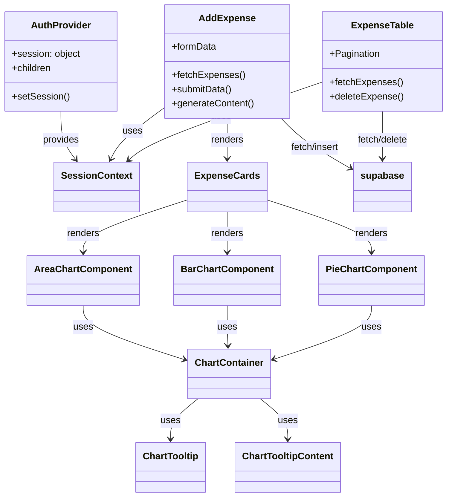

# Expensify

Expensify is a modern expense tracker built with [Next.js](https://nextjs.org), [Supabase](https://supabase.com), and [Recharts](https://recharts.org). It allows users to add, view, and analyze their expenses with interactive charts and a clean UI.

## Features

- **Authentication**: Secure login/signup using Supabase Auth.
- **Expense Management**: Add, view, and delete expenses.
- **AI-powered Descriptions**: Generate smart descriptions for expenses using Gemini AI.
- **Analytics**: Visualize expenses with area, bar, and pie charts.
- **Responsive UI**: Built with Tailwind CSS and Radix UI components.
- **Pagination**: Easily navigate through large lists of expenses.
- **Toast Notifications**: User feedback for actions and errors.

## Tech Stack

- **Frontend**: Next.js, React, Tailwind CSS, Radix UI, Lucide Icons
- **Backend**: Supabase (Database & Auth), Gemini AI (for content generation)
- **Charts**: Recharts
- **State Management**: React Context API

## Folder Structure

```
expense-tracker/
├── app/                # Next.js app directory (pages, layout, API routes)
├── components/         # Reusable React components (UI, charts, tables, etc.)
├── context/            # React context for session management
├── supabase/           # Supabase client setup
├── utils/              # Utility functions and providers
├── public/             # Static assets (images, icons)
├── styles/             # Global styles (Tailwind, custom CSS)
└── README.md           # Project documentation
```

## Getting Started

1. **Clone the repository:**

   ```bash
   git clone https://github.com/yourusername/expense-tracker.git
   cd expense-tracker
   ```

2. **Install dependencies:**

   ```bash
   npm install
   # or
   yarn install
   ```

3. **Configure environment variables:**

   - Copy `.env.example` to `.env.local` and fill in your Supabase credentials:
     ```
     NEXT_PUBLIC_SUPABASE_URL=your-supabase-url
     NEXT_PUBLIC_SUPABASE_ANON_KEY=your-supabase-anon-key
     ```

4. **Run the development server:**

   ```bash
   npm run dev
   # or
   yarn dev
   ```

5. **Open [http://localhost:3000](http://localhost:3000) in your browser.**

## Usage

- **Add Expense:** Use the "Add Expense" button to log a new expense. You can auto-generate a description using AI.
- **View Expenses:** Navigate to the "Expenses" page to see all your expenses in a paginated table.
- **Analyze:** Use the dashboard to view your spending trends with charts.

## Mermaid Class Diagram

Below is a high-level class diagram showing the main components and their relationships:



## Learn More

- [Next.js Documentation](https://nextjs.org/docs)
- [Supabase Documentation](https://supabase.com/docs)
- [Recharts Documentation](https://recharts.org/en-US/)
- [Tailwind CSS Documentation](https://tailwindcss.com/docs/installation)

## License

ISC
